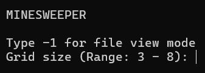
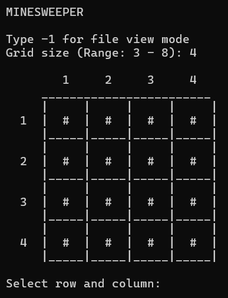
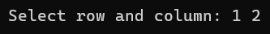
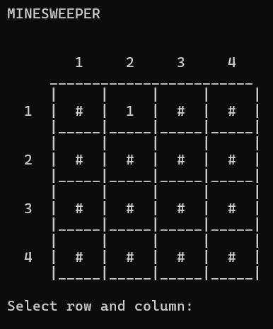
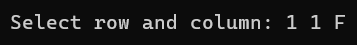
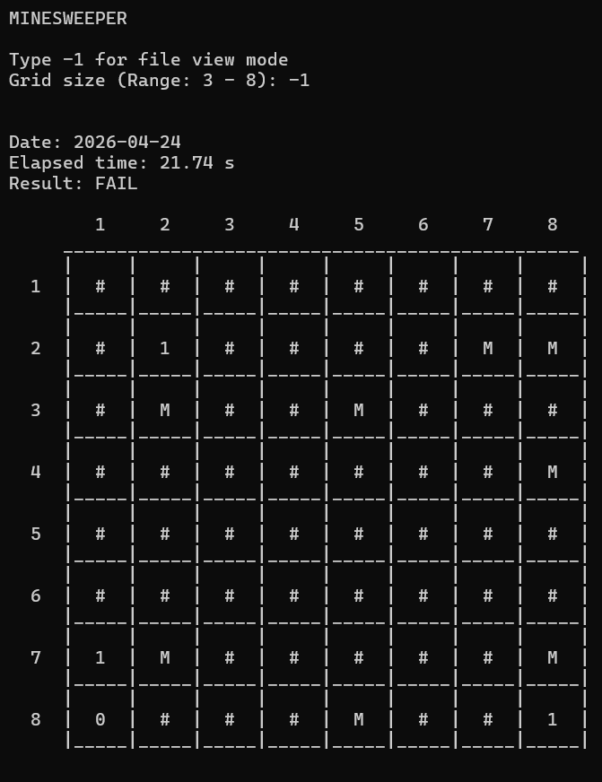

# PythonMinesweeper

## Important note: 
This is my project for university coursework. So unless you're involved in this, please ignore it.

## 1. Introduction
### What is the App
The Minesweeper game is a classic puzzle game that challenges players to clear a minefield while avoiding hidden mines. The objective is to uncover all the squares without triggering any mines. This particular implementation is designed to run in Python, utilizing a console interface.

### How to Run
To run the app, ensure you have Python 3 installed. Clone the repository and navigate to the project directory. Use the command `python minesweeper.py` to start the game.

### How to Use
Once the game starts, you will be asked to select a grid size for the minefield (allowed range is given in brackets). 

    

By typing -1 you will enter file read mode, which will be covered later. A freshly generated minefield will appear as well as prompt for selecting a tile you want to check.

    

To check a tile, type it's row and column number separated by space.

    

Selected tile revealed a number representing ammount of mines around it. If you check the tile with a mine in it, you will lose.

    

In order to win the game, you have to flag all the mines in the field. In order to place a flag, select the tile as previously shown, except this time add 'F' letter. Both lowercase and uppercase work.

    

If selected tile already has a flag in it, flag will be removed.

After losing or winning, you will be asked, if you want to save results of this session in a file. After agreeing by typing 'y' (once again, both lowercase and uppercase work), the information will be written to `data.txt` file. You can access this file through game's interface by typing -1 after launching the game.

    

## 2. Body/Analysis

### 4 OOP pillars
The program implements all 4 OOP pillars:

#### 1. Polymorphism
Polymorphism is utilized for `render_ui()` method, which is abstract in Game class. Child classes Player and UI override this method to view their elements of game's UI.

    # Method in Game class

    def render_ui(self):
        pass

    ...

    # Method in Player class

    def render_ui(self):
        try:
            msg = "Select row and column: "
            parts = input(msg).split()
            self._selected_row, self._selected_col = int(
                parts[0]), int(parts[1])
            flag = parts[2] if len(parts) > 2 else ''
        except (IndexError, ValueError):
            self._game.ui.clear()
            return

        row = self._selected_row
        col = self._selected_col
        size = self._game.size
        if row > 0 and col > 0 and row <= size and col <= size:
            if flag == 'F' or flag == 'f':
                self._game.flag_tile(row - 1, col - 1)
            elif not flag or flag == '':
                self._game.check_tile(row - 1, col - 1)

    ...

    # Method in UI class

    def render_ui(self):
        print()
        st = "   "
        for i in range(self._size):
            st = st + "     " + str(i + 1)
        print(st)

        for row in range(self._size):
            st = "     "
            if row == 0:
                for col in range(self._size):
                    st = st + "______"
                print(st)

            st = "     "
            for col in range(self._size):
                st = st + "|     "
            print(st + "|")

            st = "  " + str(row + 1) + "  "
            for col in range(self._size):
                grid = ''
                if not self._debug_mode:
                    grid = self._player_view[row][col]
                else:
                    grid = self._field.get_tile_value(row, col)

                st = st + "|  " + str(grid) + "  "
            print(st + "|")

            st = "     "
            for col in range(self._size):
                st = st + "|_____"
            print(st + '|')

        print()

    ...

    # Execution

    game = Game(8, False)

    while not game.is_over:
        game.ui.render_ui()
        game.player.render_ui()

#### 2. Abstraction
By simply initializing the Game class, multiple processes, such as requesting grid size from a user and generating the field of given size, are done automatically. All other game element (for example UI or FileManager) are also initialized within the class.

    # __init__() method of the Game class

    def __init__(self, size_limit, debug_mode=False):
        self.__min_size = 3

        self.size_limit = size_limit
        self._debug_mode = debug_mode

        self.flag_count = 0
        self.is_over = False
        self.elapsed_time = 0
        self.result = ""

        self.player = Player(self)
        self._file = FileManager("data.txt", self)
        print("Type -1 for file view mode")
        self.size = self.player.request_grid_size()
        if self.size == -1:
            self._file.read_file()

        self._field = Minefield(self.size, self.size)
        self._player_view = [
            ['#' for _ in range(self.size)] for _ in range(self.size)]

        self._generator = Generator(self.size, self._field, self._debug_mode)
        self._generator.generate_mines(self.size)
        self._generator.generate_numbers()

        self.ui = UI(self.size, self.player_view,
                     self._debug_mode, self._field)
        self.render_ui

        self._start_time = time.time()

#### 3. Inheritance
Since the program implements polymorphism, naturally, it implements inheritance as well. Both Player and UI classes inherit from the Game class.

    class Game:
        ...

    class Player(Game):
        ...

    class UI(Game):
        ...

#### 4. Encapsulation
Many class variables are marked as protected. However some variables are left to be public or use public properties for functionality reasons. What's interesting is that some classes have private methods, which are simply used to simplify the code.

    class FileManager():
        ...

        # Large private method

        def __write_data(self, f):
        f.write(f"Date: {date.today()}\n")
        f.write(f"Elapsed time: {self._game.elapsed_time:.2f} s\n")
        f.write(f"Result: {self._game.result}\n")
        f.write("\n")
        st = "   "
        for i in range(self._game.size):
            st = st + "     " + str(i + 1)
        f.write(f"{st}\n")
        for row in range(self._game.size):
            st = "     "
            if row == 0:
                for col in range(self._game.size):
                    st = st + "______"
                f.write(f"{st}\n")

            st = "     "
            for col in range(self._game.size):
                st = st + "|     "
            f.write(f"{st}|\n")

            st = "  " + str(row + 1) + "  "
            for col in range(self._game.size):
                grid = self._game.player_view[row][col]

                st = st + "|  " + str(grid) + "  "
            f.write(f"{st}|\n")

            st = "     "
            for col in range(self._game.size):
                st = st + "|_____"
            f.write(f"{st}|\n")

        f.write("\n\n")

    def save_game(self):
        if os.path.exists(self._file_name):
            with open(self._file_name, "a") as file:
                self.__write_data(file) # Using it here
        else:
            with open(self._file_name, "w") as file:
                self.__write_data(file) # And here too!

### Design pattern
This program uses **MVC (Model-View-Controller)** design pattern. I found it the most fitting for my game, since it's made of these parts. The Minefield acts as a model, UI is a view, Game and Player are controllers.

+ Minefield is a core of Minesweeper, therefore it's a model.
+ The role of a view is obviously claimed by UI class, since it's purpose is to display the model (a.k.a Minefield).
+ Game class has many functionalites to control the flow of the game and Player class is responsible for handling input from the player who controls the game. So both of them act as controllers.

### Composition
The Game class uses significant ammount of composition. All game elements, such as Minefield, Generator, Player (input), UI and FileManager, are created within the Game class.

    class Game:
        def __init__(self, size_limit, debug_mode=False):

            ...

            self.player = Player(self) # Creating player input handling system
            self._file = FileManager("data.txt", self) # Initializing file manager
            print("Type -1 for file view mode")
            self.size = self.player.request_grid_size()
            if self.size == -1:
                self._file.read_file()

            # Creating a minefield

            self._field = Minefield(self.size, self.size)
            self._player_view = [
                ['#' for _ in range(self.size)] for _ in range(self.size)]

            # Initalizing generator

            self._generator = Generator(self.size, self._field, self._debug_mode)
            self._generator.generate_mines(self.size)
            self._generator.generate_numbers()

            # Creating UI

            self.ui = UI(self.size, self.player_view,
                        self._debug_mode, self._field)
            self.render_ui

## 3. Results and Summary
### Results
As the result, I have sucessfully created a functional Minesweeper using Python. All core elements of the game are working properly. The hardest part was the beginning, where I was trying to figure out, how the structure of the game should look like in OOP language, such as Python.

### Conclusions
For me, this was an interesting challenge. It was my first time creating a game using Python, which in my opinion, turned out to be successful.

### Extension Possibilities
There is still a room for improvement. UI could be transformed from basic text on a terminal to a proper game interface with ability to interract with the game using mouse. I could also improve tile checking, which would simplify the gameplay. I would achieve this the following way: by checking a 0 tile, all other number tile around it would be revealed, just like in other Minesweeper games.